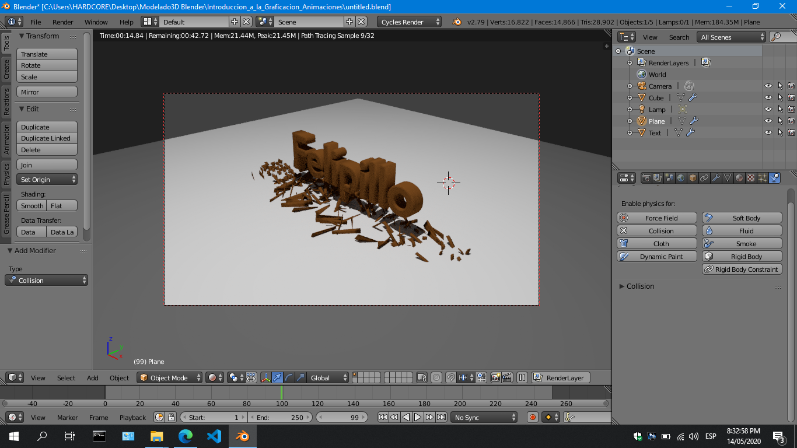

## INTRODUCCIÓN A LA GRAFICACIÓN POR COMPUTADORA
# Integrante
* Luis Gerardo Perales Torres
* Ejemplo 


# ANIMACIONES

**Objetivo:**

Al finalizar la práctica, conocerá algunos de los efectos básicos de animación en blender,
mediante el uso de la línea de tiempo para crear un video, así como del proceso de renderización y
grabación de la misma.

**Introducción:**

En esta práctica aprenderá el uso de la escritura de texto, reafirmará la conversión de un texto u
objeto a una estructura sólida para animación. Así mismo empleará efectos de animación rápidos y hará
uso de textura y de iluminación respecto a un punto fijo de la cámara.

**Desarrollo:**

**PASO 1:**
Primeramente en el menú inicial seleccione nuevo proyecto seleccionando File y después New,
o use el que por defecto le entrega Blender,.

Usando CTRL-N, recargue el archivo.

Usando RMB seleccione el cubo, después presione 'X' y borre el cubo.


## INTRODUCCIÓN A LA GRAFICACIÓN POR COMPUTADORA

Use **SHIFT-A** y seleccione la opción **text**.

## PASO 2:

Con el texto seleccionado, presione ' **R** ' y después para seleccionar el eje de rotación presione
' **X** ', tecle 90 y de **<Enter>** en el teclado. Esto rotará el texto 90 grados, dejándolo como se observa.

A continuación, cambie a modo edición, tecle “ **TAB** ”, después de esto use la tecla backspace
para borrar el texto como si estuviera en un editor de texto, y teclee su nombre (Ej.: Felipillo), una vez
tecleado su nombre use la tecla “ **TAB** ” para regresar a modo objeto.


## INTRODUCCIÓN A LA GRAFICACIÓN POR COMPUTADORA

## PASO 3:

El texto está sin profundidad, para poder agregarle cierta profundidad, haga lo siguiente:
Seleccione el botón “ **object data** ”

A continuación en la sección “ **Geometry** ”, asigne los siguientes valores:

**Extrude** le proporcionará grosor al texto, mientras que **Depth** le proporcionará una profundidad en los
bordes que combinada con **Resolution** le permitirá ver el borde más suavizado.

Posteriormente, use **SHIFT-A** seleccione **Mesh** y agregue un **Cube**. Terminando presione **5**
para perspectiva Ortogonal y después **1** para vista de frente.

## PASO 4:

Posteriormente se debe cambiar a modo alambrado (“ **wireframe** ”), se debe centrar el cubo para
que abarque todo el texto a lo largo y ancho y lo sobrepase por un margen ligeramente mayor.
Mantener seleccionado el cubo, centrarlo sobre el texto y escalarlo, use para escalar ' **S** ' y ' **X** ' y
' **Z** ' para escalar en esos ejes. Una vez finalizados los ejes -x- y -z-, pase al eje -y- para ello, presiones **3**
y escale usando ' **S** ' y después ' **Y** ', al terminar presiones **1** para regresar a la vista frontal.


## INTRODUCCIÓN A LA GRAFICACIÓN POR COMPUTADORA

```
Una vez terminado, la imagen frontal quedará como sigue:
```
## PASO 5:

```
Seleccione el botón “ object modifier ” :
```
```
Seleccion ahora “ Add Modifier ” y después de esto la opción “ Bevel ”:
```

## INTRODUCCIÓN A LA GRAFICACIÓN POR COMPUTADORA

Una vez seleccionado configurar: **width=0.2** y **segment=5** , esto para hacer más suavizados los
cortes de la caja, ya asignados estos valores hay que hacer click en “ **apply** ”.

Finalmente, regrese a “ **Edit Mode** ” usando la tecla “ **TAB** ” y presione ' **A** ' las veces necesarias
para cerciorarse que no tenga nada seleccionado.

**PASO 6:**

Ahora debe seleccionar los vértices de la parte izquierda y derecha del cubo inicial y escalarlos en el
eje -x-. Para ello use ' **B** ' seleccione primero los vértices de un lado y luego los del otro, escalándolos
con ' **S** ' y presionando ' **X** ' y después teclee **0.2** para escalarlos a ese nivel, finalmente presione
<ENTER>.

Regrese a “ **Object mode** ” y nuevamente use “ **Add modifier** ” y seleccione ahora “ **Remesh** ”,
asigne el valor de **7** a “ **Octree Depth** ”, después use “ **apply** ”.


## INTRODUCCIÓN A LA GRAFICACIÓN POR COMPUTADORA

```
Ahora seleccione “Solid”
```
PASO 7:

```
Seleccione “tool” y después el botón “smooth”.
```
```
Ahora haga click en “ material ” y luego click en “ new ”.
```
```
Seleccione “Cycles Render” y haga click en “Use node”
```
```
Hacer click en el botón “Use Nodes”
```
```
Ahora seleccionar el botón al lado de la opción “Color”:
```

## INTRODUCCIÓN A LA GRAFICACIÓN POR COMPUTADORA

Una vez seleccionado , seleccione “Image Texture”:

```
Cargue la imagen “ wood_texture.jpg ” usando el botón “ Open ”:
```
Para hacer que la imagen se pegue al objeto deseado se debe hacer una operación matricial
“ **UV** ”, para hacerlo en **blender** se debe hacer lo siguiente:
Presione “ **TAB** ” para estar en modo de edición:

Presionar “ **A** ” y seleccionar todo el cubo:

Ahora presionar “ **U** ” y seleccionar “ **Project from View(Bounds)** ”:

Presione “ **TAB** ” para regresar a “ **Object Mode** ”.

Si va ahora al botón “Material” y selecciona “Material” podrá observar la imagen de la madera pegada
ya al cubo:


## INTRODUCCIÓN A LA GRAFICACIÓN POR COMPUTADORA

Debe hacer lo mismo ahora con el texto, para hacer lo siguiente, seleccione el botón “ **Layout** ” y
seleccione “ **Compositing** ”.

Haga click en el botón “Shader”:

Observará la relación de colores con el material enlazados en bloques:

Para el objeto se debe seleccionar la opción “Color” de la imagen y enlazarla al desplazamiento
lo cual trabaja bien para imágenes tipo madera, pero no para otro tipo.


## INTRODUCCIÓN A LA GRAFICACIÓN POR COMPUTADORA

```
Seleccionar nuevamente el botón “ Layout ” y seleccionar “ Default ”.
```
```
Asigne un nombre al material de la imagen para usarlo más adelante:
```
```
En el listado de objetos, seleccionar el cubo, y quitarle la visibilidad para solo ver el texto:
```
Seleccionar ahora el texto, y siguiendo con la opción de material seleccionado hacer click en el
botón “New”.


## INTRODUCCIÓN A LA GRAFICACIÓN POR COMPUTADORA

En el botón de selección del material, desplegar las opciones y seleccionar la opción creada
“ **madera** ”.

Ahora se debe convertir el texto a objeto, para hacerlo seleccionar el texto y con el shorcut
“ **ALT-C** ”, seleccionar “ **Mesh from Curve/Meta/surf/Text** ”.

Presione “ **TAB** ” para ir a “ **Edit Mode** ”, y presione “ **A** ” para seleccionar todo el texto.
Presione nuevamente “ **U** ” y seleccione como lo hizo anteriormente “ **Project from View (Bounds)** ”.

```
Si presiona “ TAB ” para regresar a “ Object Mode ”, observará ya la textura sobre el texto.
```
```
Regrese la visibilidad al cubo presionando nuevamente el botón en forma de ojo.
```
## PASO 8:

```
Agregar un plano al objeto terminado, usando “Shift-A” y en “Mesh” seleccionar “Plane”:
```

## INTRODUCCIÓN A LA GRAFICACIÓN POR COMPUTADORA

```
Mueva el plano abajo del objeto, y después escalelo con “ S ”, en “ X ” y “ Y ” a un valor de 100.
```
Seleccione el material para el plano, presionando el botón “ **New** ”. Mantenga todos los valores
predeterminados. Después presione “ **3** ” y cambien a vista lateral.

```
Mueva la lámpara de derecha a izquierda un poco abajo de la cámara.
```
```
Presione “ 1 ” y regrese a vista de frente.
Con el botón “ Data Object ” cambie el Size a 3.
```
```
Haga click en el botón “ Use Nodes ” y cambie el valor de “ Strength ” a 3000.
```

## INTRODUCCIÓN A LA GRAFICACIÓN POR COMPUTADORA

Use “ **Shift-D** ” y copie la lámpara a una posición similar pero más alejada en el lado contrario.

Ahora presione “ **0** ” y después “ **N** ” para fijar la cámara.

Presione “ **N** ” para salir del menú de la cámara.

Para observar como va quedando, seleccione el botón “Material” y seleccione “Render”.


## INTRODUCCIÓN A LA GRAFICACIÓN POR COMPUTADORA

```
Nuevamente el menú “ ViewPort ” seleccione ahora “Solid”:
```
Seleccione el cubo, y en el menú “Object” seleccione la opción “ **Quick Effects** ” con la opción
“ **Quick Explode** ”.


## INTRODUCCIÓN A LA GRAFICACIÓN POR COMPUTADORA

```
Seleccione el botón “ Particle ”
```
```
Los botones de abajo limitan la animación,
```
```
El inicio y el final, y el tercero indica donde se encuentra actualmente en el tiempo.
Ajuste el valor del final a 100.
```
La animación se fija de 20 a 70, esto se hace en el recuadro de los valores para la opción de
partículas.

```
El tiempo de vida de las partículas se debe conservar en toda la animación, fije el valor a 100.
```
La opción “ **Number** ” determina el número de partículas que participan en la animación, un
valor grande hará esto más real, pero el renderizado será más lento.
Use **500** para un valor de pruebas y **20,000** para una mejor animación.
Use el botón **play** para ver como pasa.

Para que el video empiece desde la izquierda y tener control sobre la forma en que se llevan las
colisiones, vaya a la sección “ **Textures** ” y seleccione “ **New** ”.

```
Una vez hecho seleccione el botón “Texture”.
```

## INTRODUCCIÓN A LA GRAFICACIÓN POR COMPUTADORA

```
Luego en “ Image Texture ” seleccione “ ParticleSystem.Texture ”.
```
```
En “ Type ” seleccione “ Blend ”.
```
## PASO 9:

Ahora las partículas fluyen del lado izquierdo al derecho, pero caen más abajo que el piso, esto
se debe controlar y que las partículas queden sobre el piso.
Seleccion el botón botón “Modifer” que tiene tipo de llave inglesa.
Agregue un modificador y seleccione “ **Solidify** ”.

```
Seleccione el plano, y después el botón de “ Physics ”:
```
```
Seleccione la opción “ Collision ” para evitar que las partículas pasen más abajo que el piso.
```
```
Cambie el Damping Factor a 1 , para evitar el rebote de las partículas sobre el piso.
Cambie también el valor de la fricción para que las partículas no se deslicen sobre el piso.
```

## INTRODUCCIÓN A LA GRAFICACIÓN POR COMPUTADORA

## PASO 10:

Seleccione el texto ahora, para evitar que las partículas pase a través del texto. Haga la
siguiente asignación de valores:
**Particle Damping Factor =
Partcile Friction Factor = 0**

Finalmente con la opción de Renderizado, cambie el valor de las muestras si desea una mayor
nitidez en la imagen, el valor default esta en Render=10.
Si quiere guardar el video de salida, seleccione en Output en donde quiere guardar su video.

```
La opción de formato de imagen, le permite guardar en los siguientes formatos:
```

## INTRODUCCIÓN A LA GRAFICACIÓN POR COMPUTADORA

```
Seleccion MPEG o AVI según desee.
```
Si desea guarde su proyecto antes del renderizado por si algo sale mal, ya que el proceso se
lleva varios minutos u horas.
Finalmente haga click en el botón de animación:

```
Finalmente su animación estará completa.
```
**REVISIÓN (puntos para unidad 1 – 10 pts)**

Ahora que ya ha se ha acostumbrado al uso de herramientas de blender, para efectos de revisar
lo que aprendió para efectos de revisión deberá escribir su nombre completo a dos líneas, en la parte
superior su nombre o nombres y en la parte inferior sus apellidos. La fecha para revisión es **ENERO
16, 2015** , en la hora de clase.

```
______ FIN PRÁCTICA 1 – UNIDAD 2______
```

